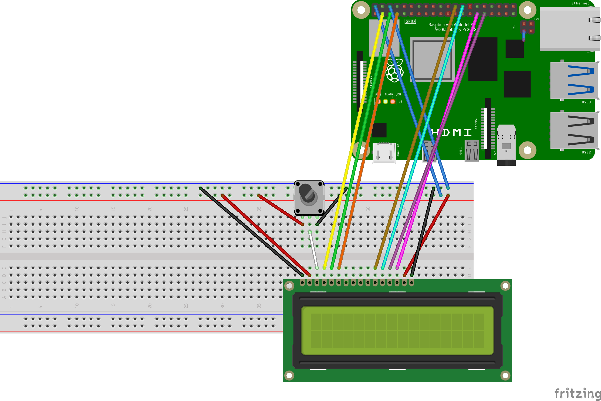
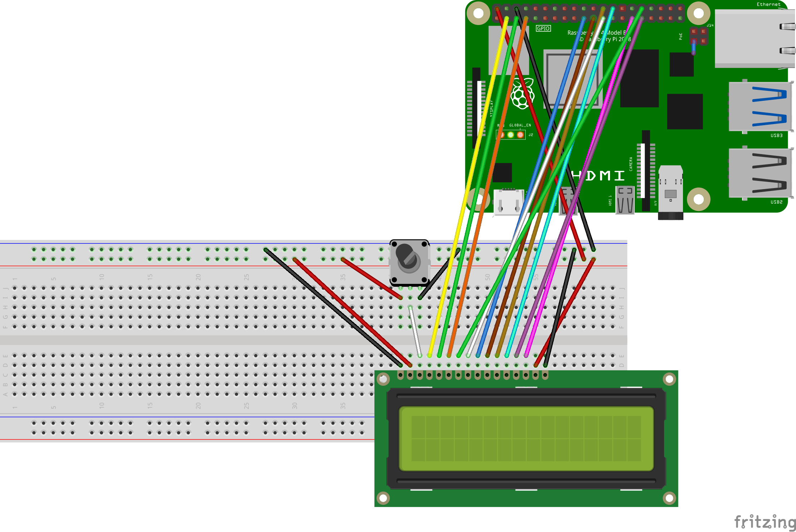

# CharDisplay

Raspberry Pi package for controlling 16x2 character display (1602 LCD) on **HD44780U module** written in Julia.

## Installation

Julia must be installed on Raspberry Pi. 
I have tested on v1.1.0 which can be installed with:
```sh
sudo apt update
sudo apt install julia
```

The package can be installed from Julia environment with:

```julia
] add https://github.com/metelkin/CharDisplay.jl.git
```

## Usage

```julia
# setting connected pins
d = DisplayP4(
    2, # RS
    3, # RW
    4, # E
    5, # D7
    6, # D6
    7, # D5
    8  # D4
)

write(d, "Julia +")
set_cursor(d, 0, 1) # move cursor to the second line
write(d, "Raspberry Pi")
```

## Circuits

### A. Connection for 4 bit mode

Display pins can be connected to any RaspberryPi GPIOs.
For example this scheme is based on the following connections:
- VSS => GND (chip ground)
- VDD => +5V (chip power)
- V0 => central terminal of the potentiometer to get 0..+5V
- RS => GPIO2
- RW => GPIO3
- E => GPIO4
- D7-D4 => GPIO5-GPIO8
- A, R (light power) can be connected to 3.3V or 5V bus



### B. Connection for 8 bit mode

Display pins can be connected to any RaspberryPi GPIOs.
For example this scheme is based on the following connections:
- VSS => GND (chip ground)
- VDD => +5V (chip power)
- V0 => central terminal of the potentiometer
- RS => GPIO2
- RW => GPIO3
- E => GPIO4
- D7-D0 => GPIO5-GPIO12
- A, R (light power) can be connected to 3.3V or 5V bus



## Known issues and limitations

- Currently only parallel 8bit/4bit mode (without display driver) is supported.

- The maximal rate (**333 Byte/s**) is limited by too long pauses between switching pins.
    The package uses `sleep(time)` function where `time` cannot be less than `1e-3` (second).
    The theoretical rate can be **25000 Byte/s** and it needs another approach without `sleep` function.

- The package works only in writing mode. Reading mode and checking BF (busy flag) signal is not supported.

## Related projects

- For more information read datasheet to the module

- https://www.mbtechworks.com/projects/drive-an-lcd-16x2-display-with-raspberry-pi.html

- 